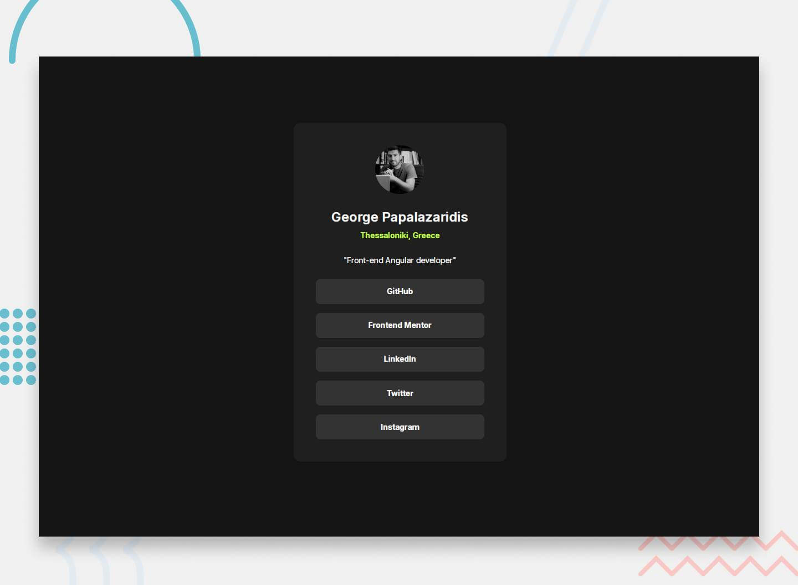
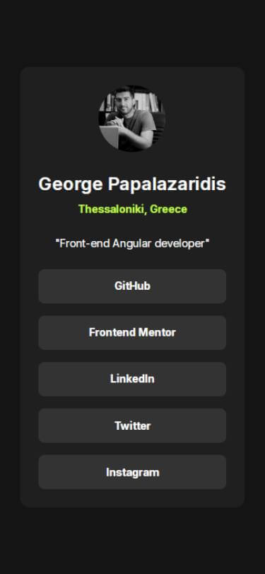
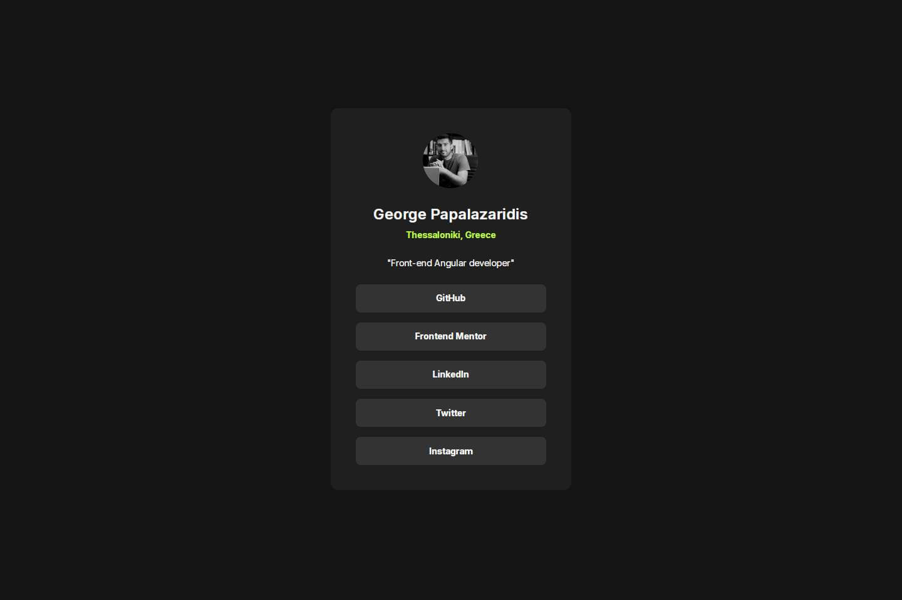
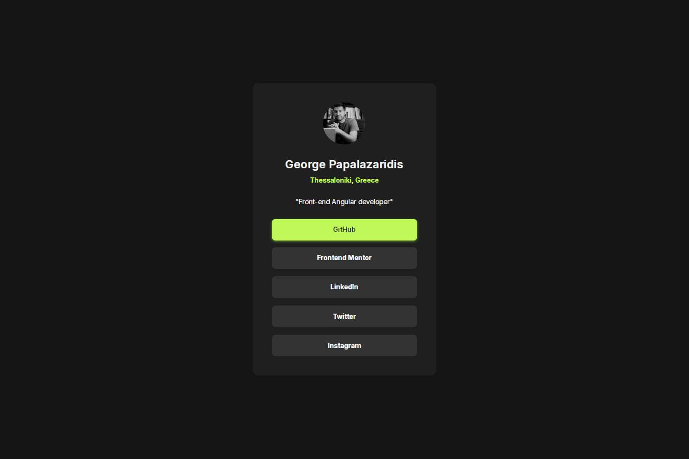

# **Social Links Profile**



This repository contains my solution for the **Frontend Mentor - Social Links Profile Challenge**. The challenge focuses on creating a responsive and accessible profile card featuring social links with interactive hover and focus states. The project is built using semantic HTML, modern CSS techniques, SCSS for efficient styling, and JavaScript for dynamic content rendering.

---

## **📋 Table of Contents**

- [Overview](#overview)
  - [Features](#features)
  - [Preview](#preview)
- [Technologies Used](#technologies-used)
- [File Structure](#file-structure)
- [Setup Instructions](#setup-instructions)
- [Meta Information](#meta-information)
- [Refactoring Details](#refactoring-details)
- [Learnings](#learnings)
- [Author](#author)

---

## **📖 Overview**

### **Features**

- **Responsive Design**: Seamlessly adapts to mobile, tablet, and desktop screens.
- **Interactive States**: Buttons include hover, focus, and active states for enhanced UX.
- **Accessibility**: Semantic markup and focus management ensure full accessibility compliance.
- **Dynamic Rendering**: Social media buttons are dynamically generated via JavaScript for better maintainability.
- **SCSS Workflow**: Modular and maintainable styling with variables and nesting.

### **Preview**

Here’s how the project looks across various screen sizes:

- **Mobile View**:  
  
- **Desktop View**:  
  
- **Active State**:  
  

---

## **🛠 Technologies Used**

- **HTML5**: Semantic and accessible structure.
- **CSS3**: Custom properties and modern layout techniques.
- **SCSS**: For reusable, modular, and maintainable styles.
- **JavaScript**: Dynamically renders social media buttons.
- **Normalize.css**: Ensures browser consistency for base styles.

---

## **📂 File Structure**

The project is organized into the following structure for better maintainability and scalability:

```
social-links-profile/
├── css/
│   ├── _global.scss                # Global styles
│   ├── _responsiveness.scss        # Media queries and responsive styles
│   ├── _social-card-buttons.scss   # Styles for social card buttons
│   ├── _social-card-header.scss    # Styles for the card header
│   ├── _variables.scss             # SCSS variables for theming and reusability
│   ├── normalize.scss              # Normalize.css for consistent base styling
│   ├── styles.css                  # Compiled CSS file
│   ├── styles.css.map              # Source map for compiled CSS
│   └── styles.scss                 # Main SCSS entry point
├── images/
│   ├── active-states.jpg           # Preview of active states
│   ├── destkop-design.jpg          # Desktop layout design
│   ├── favicon-32x32.png           # Favicon for the project
│   ├── george-pap.png              # Author's profile image
│   ├── mobile-design.jpg           # Mobile layout design
│   └── preview.jpg                 # Overall design preview
├── javascript/
│   └── script.js                   # JavaScript for dynamic button rendering
├── .gitignore                      # Git ignore rules
├── index.html                      # HTML structure of the project
├── LICENSE                         # Project license
└── README.md                       # Documentation for the project
```

### Key Highlights:
- **SCSS Modular Structure:** SCSS files are organized by purpose (_global, _variables, components, and responsiveness).
- **Images:** Includes all visual assets used in the project, such as designs and previews.
- **JavaScript:** Contains reusable logic for dynamically rendering the social card's buttons.
- **HTML and README:** The `index.html` file serves as the project's base structure, while the `README.md` provides detailed documentation for developers and collaborators.

---

## **⚙️ Setup Instructions**

### **Prerequisites**

Ensure you have the following installed:

- Node.js
- npm or yarn

### **Installation Steps**

1. **Clone the repository**:
   ```bash
   git clone https://github.com/GeorgePapalazaridis/social-links-profile.git
   ```
2. **Navigate to the project directory**:
   ```bash
   cd social-links-profile
   ```
3. **Install dependencies**:
   ```bash
   npm install
   ```
4. **Compile SCSS**:
   ```bash
   npm run sass
   ```
5. **Preview the project**:  
   Open `index.html` in your browser or use a live server.

---

## **🌐 Meta Information**

To improve SEO and social sharing, the following meta tags were included:

```html
<meta
  name="description"
  content="A responsive and accessible social links profile card built with HTML, CSS, and SCSS. Features interactive hover and focus states for enhanced user experience."
/>
<meta property="og:title" content="Social Links Profile" />
<meta
  property="og:description"
  content="A responsive and accessible social links profile card. Built with semantic HTML, modern CSS, and SCSS."
/>
<meta property="og:image" content="./images/preview.jpg" />
<meta
  property="og:url"
  content="https://georgepapalazaridis.github.io/social-links-profile/"
/>
<meta name="twitter:card" content="summary_large_image" />
```

---

## **🔄 Refactoring Details**

The project has been successfully refactored to improve maintainability and reusability:

1. **Componentized Buttons**: The `<li>` elements have been refactored into a reusable button component dynamically generated via JavaScript:

   ```javascript
   function createSocialButton(href, label) {
     const li = document.createElement("li");
     li.classList.add("button");

     const a = document.createElement("a");
     a.href = href;
     a.target = "_blank";
     a.rel = "noopener noreferrer";
     a.textContent = label;

     li.appendChild(a);
     return li;
   }
   ```

2. **Dynamic Data Handling**: Dynamic data injection for `href` and `label` was implemented using reusable templates in JavaScript, reducing redundancy and improving scalability.

---

## **✨ Learnings**

- Gained experience with advanced CSS techniques like `:focus-within`, `:hover`, and active states for buttons.
- Improved SCSS modularity and styling consistency through the use of variables and nesting.
- Enhanced understanding of accessibility best practices for navigation, focus management, and semantic HTML structure.
- Successfully implemented reusable components using JavaScript to dynamically render content and promote DRY (Don't Repeat Yourself) principles.
- Learned to manage dynamic `base` paths for GitHub Pages deployments.

---

## **👤 Author**

- **GitHub**: [@GeorgePapalazaridis](https://github.com/GeorgePapalazaridis)
- **Frontend Mentor**: [@GeorgePapalazaridis](https://www.frontendmentor.io/profile/GeorgePapalazaridis)
- **LinkedIn**: [George Papalazaridis](https://www.linkedin.com/in/george-papalazaridis-865689120/)

---

✨ Thank you for reviewing my project! Feel free to connect with me for feedback or collaboration. 😊
